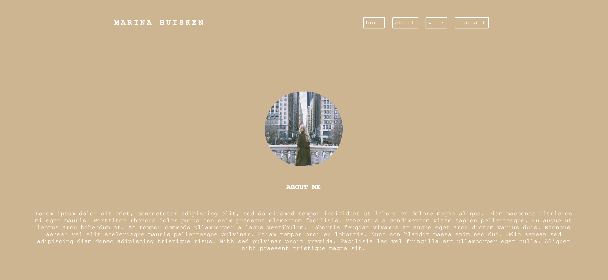

# Updated Portfolio

# Description

Updated portfolio. Building off of first portfolio from class. 

# Site Preview

# Github Links

- Repository: https://github.com/mxhuisken/hw_updatedPortfolio
- Deployed: https://mxhuisken.github.io/hw_updatedPortfolio/

# Requirements

- Must have updated work section referencing projects submited from class.
- Updated CSS
